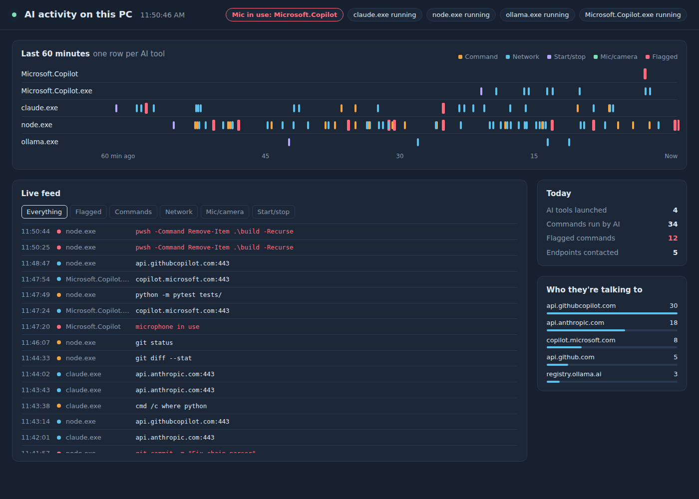

# AI Activity Monitor

See what AI tools are doing on your Windows PC, live: which ones are running, what commands they run, which services they talk to, and when anything uses your mic or camera.



## What it tracks

- AI tools starting and stopping (Claude, Copilot, ChatGPT, Ollama, Cursor, LM Studio, GitHub Copilot CLI, Claude Code, and more)
- Commands AI tools spawn (PowerShell, cmd, git, python, curl...), with risky ones flagged
- Network endpoints each AI tool connects to
- Microphone and camera use by any app, from Windows' own privacy records

Browse history with the timeframe dropdown and look-back slider — not just live activity, the full range you've collected. Drag back to freeze on a past window; jump back to "Live" any time.

All data stays local in `%LOCALAPPDATA%\AIMonitor\aimon.db`. The dashboard listens on `127.0.0.1` only.

## Quick start

Requires Windows 10/11 and the Rust toolchain (MSVC), plus `trunk` for building the frontend:

```powershell
winget install --id Rustlang.Rustup -e
rustup target add wasm32-unknown-unknown
cargo install trunk --locked
```

(`cargo install trunk` needs the MSVC linker — if it fails with `link.exe not found`, install the Visual Studio Build Tools with the "Desktop development with C++" workload first.)

Then:

```powershell
git clone <repo-url>
cd ai-activity-monitor
powershell -ExecutionPolicy Bypass -File .\install.ps1
```

This builds the frontend and three release binaries, registers three scheduled tasks that run at logon (collector, dashboard, 9 PM daily report), and opens the dashboard at http://127.0.0.1:8765.

To run manually instead, use two terminals:

```powershell
cargo run --release -p aimon-collector
cargo run --release -p aimon-dashboard
```

To uninstall:

```powershell
"AIMonitor-Collector","AIMonitor-Dashboard","AIMonitor-DailyReport" | % { Unregister-ScheduledTask -TaskName $_ -Confirm:$false }
```

## Project layout

| Path | Purpose |
|---|---|
| `crates/aimon-collector` | Polls every 3 seconds and writes events to SQLite |
| `crates/aimon-dashboard` | Local web server, JSON API (`/api/state`, `/api/events`, `/api/meta`, `/api/river`), and the embedded frontend |
| `crates/aimon-report` | Static daily HTML report |
| `crates/aimon-core` | Shared schema, DB access, process/network/registry monitoring, AI-tool matching rules |
| `crates/aimon-api-types` | Wire types shared between the dashboard server and the frontend |
| `frontend/aimon-ui` | Leptos (Rust/WASM) dashboard UI, built with `trunk` |
| `install.ps1` | Build + scheduled task setup |

To add AI tools to watch, edit `AI_NAME_MATCH` / `AI_CMDLINE_MATCH` in `crates/aimon-core/src/rules.rs`.

## Known limits

- Browser-based AI (ChatGPT or Claude in a browser tab) shows up as the browser, not the AI service.
- Commands that finish in under ~3 seconds can be missed between polls.
- Mic/camera detection reads Windows registry data and has only been validated on Windows 11.

## Roadmap

- [ ] Event-driven capture via Sysmon or ETW (no missed short commands)
- [ ] Detect AI usage in browsers (history or DNS)
- [ ] File-change monitoring for AI processes, with alerts on sensitive paths (`.ssh`, `.env`, credentials)
- [ ] Ingest CLI agent session logs (GitHub Copilot CLI, Claude Code)
- [ ] Desktop notifications for flagged commands and mic/camera use
- [ ] Multi-PC support, shipping events to a home lab server
- [ ] MCP server so an AI assistant can answer "what did AI do on my PC yesterday?"

## Contributing

Work on a branch and open a pull request against `main`. Never commit a real `aimon.db` or generated reports; they contain your activity history.
